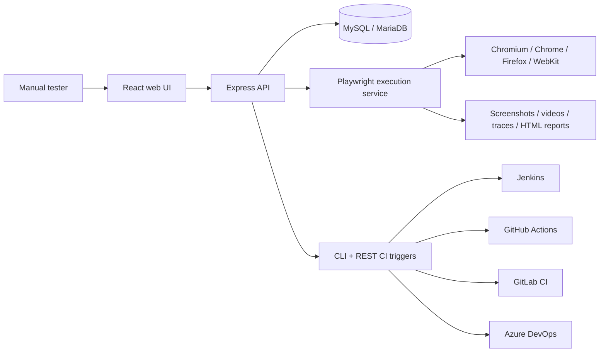

# System Architecture

## Goal

Build a browser-based no-code test automation platform for manual testers. Users create tests as structured steps, and the backend converts those steps into Playwright browser actions.

## Recommended Architecture



## Frontend Framework

React with Vite and TypeScript is used for the MVP because it is fast to build, easy to deploy, and familiar to enterprise teams. The UI is organized around tester workflows:

- Dashboard
- Test library
- No-code test builder
- Suite manager
- Run history
- Debug center
- Reports

## Backend Framework

Express with TypeScript is used for the API. It keeps the service simple while still supporting enterprise concerns:

- Authentication and role-based access control
- REST APIs for tests, suites, runs, reports, and dashboards
- Playwright execution orchestration
- CI-friendly CLI entry point
- Centralized validation, logging, and error handling

For a larger enterprise rollout, this backend can evolve to NestJS or split the Playwright runner into a queue-backed worker service.

## Database

MySQL/MariaDB is used so QA leads and admins can inspect and manage data through phpMyAdmin. Prisma owns schema migrations and type-safe access.

Core tables:

- `users`
- `projects`
- `test_cases`
- `test_steps`
- `test_suites`
- `test_suite_mapping`
- `test_runs`
- `test_step_results`
- `logs`
- `attachments`

## Playwright Execution Service

The runner receives a normalized test case JSON payload, launches the selected browser, resolves each locator, executes actions in order, records results for every step, and stores artifacts.

Supported actions:

- `goto`
- `click`
- `type`
- `select`
- `verify_text`
- `wait`
- `upload_file`
- `download_file`
- `screenshot`

Supported locator types:

- CSS
- XPath
- text
- role
- label
- placeholder

## API Design

The API is REST-first for simplicity and CI compatibility. Key endpoint families:

- `/api/auth`
- `/api/projects`
- `/api/test-cases`
- `/api/test-suites`
- `/api/runs`
- `/api/dashboard`
- `/api/ci`

## Authentication and RBAC

Roles:

- `ADMIN`: full platform configuration
- `QA_MANAGER`: project, suite, and run management
- `TESTER`: create/edit tests and run/debug
- `VIEWER`: read-only dashboards and reports

JWT bearer tokens protect API routes. Production deployments should add SSO/SAML/OIDC.

## Reporting Strategy

Reports are stored as database records and artifact files:

- Step logs in `test_step_results`
- Screenshots and videos in `attachments`
- Trace ZIP files in `attachments`
- Generated HTML run summary
- CSV export from the API/UI
- PDF export planned for the enhanced version

## Logging Strategy

Every run gets structured logs:

- run-level lifecycle logs
- step-level action logs
- locator resolution messages
- error stack and failure messages
- artifact creation logs

The MVP stores logs in MySQL. Enterprise deployments can ship logs to ELK, Datadog, Splunk, or OpenTelemetry.

## Error Handling

The backend uses:

- request validation with Zod
- centralized Express error middleware
- consistent error response shape
- run/step failure records for Playwright failures
- artifact capture on failed steps

## Scalability

MVP execution runs in the API process. For higher volume:

- move execution into a separate worker service
- use Redis/BullMQ, RabbitMQ, or SQS for run queues
- scale browser workers horizontally
- store artifacts in S3/Azure Blob/GCS
- add project-level runner pools
- add environment variables and secret vault integration
- shard by project for large QA organizations

## Folder Structure

```text
apps/
  api/
    prisma/
    src/
      config/
      db/
      middleware/
      routes/
      services/
        execution/
        reporting/
  web/
    src/
      components/
      lib/
      styles/
packages/
  shared/
    src/
docs/
ci/
.github/workflows/
```

## Example Test Case JSON

```json
{
  "id": "tc_login_001",
  "projectId": "project_prudent",
  "title": "Valid user can log in",
  "groupType": "SMOKE",
  "baseUrl": "https://example.test",
  "tags": ["login", "smoke"],
  "steps": [
    {
      "stepNumber": 1,
      "actionType": "goto",
      "inputValue": "/login",
      "expectedResult": "Login page opens"
    },
    {
      "stepNumber": 2,
      "actionType": "type",
      "locatorType": "label",
      "locatorValue": "Email",
      "inputValue": "qa@example.test",
      "expectedResult": "Email is entered"
    },
    {
      "stepNumber": 3,
      "actionType": "click",
      "locatorType": "role",
      "locatorValue": "button:Sign in",
      "expectedResult": "Dashboard opens"
    },
    {
      "stepNumber": 4,
      "actionType": "verify_text",
      "locatorType": "text",
      "locatorValue": "Welcome back",
      "expectedResult": "Welcome back"
    }
  ]
}
```

## Example Generated Playwright Logic

```ts
for (const step of testCase.steps) {
  const locator = resolveLocator(page, step);

  if (step.actionType === "click") {
    await locator.click({ timeout: step.timeoutMs ?? 10000 });
  }

  if (step.actionType === "type") {
    await locator.fill(step.inputValue ?? "", { timeout: step.timeoutMs ?? 10000 });
  }

  if (step.actionType === "verify_text") {
    await expectText(page, step, locator);
  }
}
```

